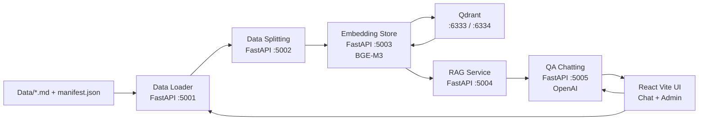
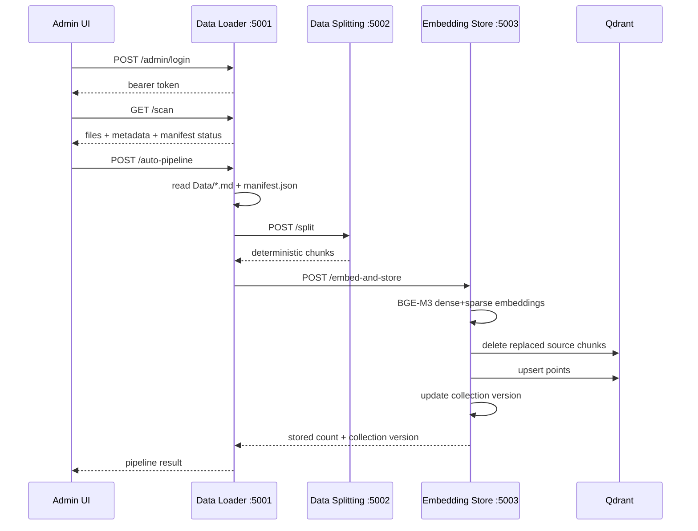
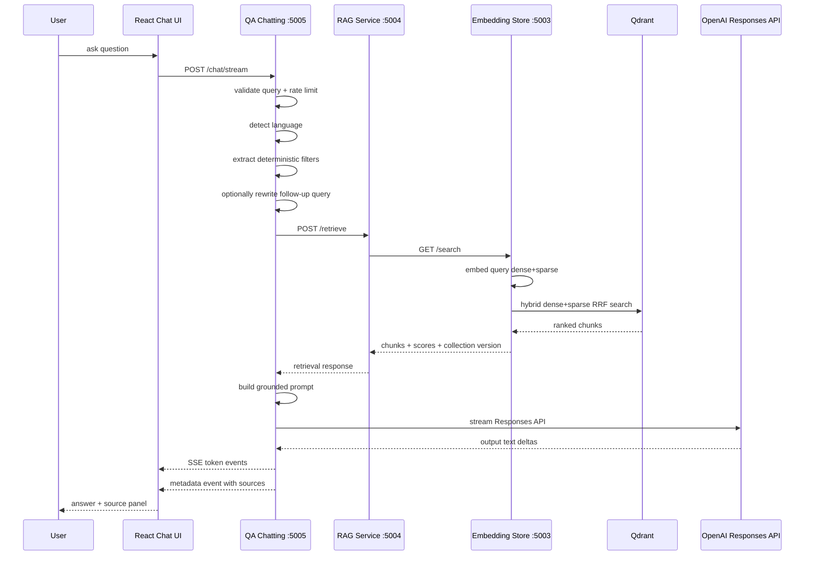

# SPU Admission Chatbot RAG System Design

Date: 2026-06-21  
Status: Current repository implementation  
Audience: engineers, reviewers, maintainers, DevOps, and project stakeholders

## 1. Executive Summary

This document outlines the architecture, service boundaries, data flow, and operational
considerations for the SPU Admission Chatbot. The system is a bilingual English-Arabic
Retrieval-Augmented Generation application designed to answer admission-related questions
using only approved university source documents. It combines a microservice-based backend,
hybrid vector search, multilingual embeddings, and a React-based user interface to provide
accurate, source-backed responses.

The platform is intended for controlled institutional use. Reviewed Markdown documents are
ingested, divided into deterministic chunks, embedded with dense and sparse vectors, stored
in Qdrant, and retrieved at query time to support grounded answer generation. The public chat
experience includes streaming responses, source attribution, multilingual output, short
conversation memory, rate limiting, retrieval and answer caching, collection-version
invalidation, and usage telemetry.

### 1.1 Document Purpose

This document serves as the primary reference for:

- system architecture and component responsibilities;
- ingestion and retrieval workflows;
- runtime topology and API contracts;
- security, caching, observability, evaluation, and deployment guidance.

## 2. System Goals

The system optimizes for:

- Accurate admissions answers grounded in approved SPU documents.
- Arabic and English user experience.
- Clear source traceability for every generated answer.
- Deterministic ingestion and stable chunk identity across runs.
- Hybrid retrieval quality using semantic and lexical signals.
- Safe fallback behavior when sources do not contain the answer.
- Admin-controlled ingestion pipeline.
- Observable cost, latency, retrieval, and cache behavior.
- Local Docker-based operation with a path toward production hardening.

The system intentionally avoids:

- Answering from general model knowledge when source evidence is missing.
- Serving stale cached answers after data ingestion changes.
- Broad semantic answer caching before an evaluation suite exists.
- Exposing admin actions without bearer-token authorization.

## 3. High-Level Architecture



The services communicate over the Docker Compose bridge network:

| Layer | Service | Port | Main responsibility |
| --- | --- | ---: | --- |
| Frontend | `spu-ai-connect-main` | 5173 | Chat UI, admin UI, language/theme shell |
| Data ingestion | `data-loader` | 5001 | Scan Markdown files, validate manifest metadata, start pipeline |
| Chunking | `data-splitting` | 5002 | Header-aware Markdown splitting and deterministic chunk IDs |
| Embeddings and storage | `embedding-store` | 5003 | BGE-M3 dense+sparse embeddings, Qdrant upsert/search, collection version |
| Retrieval facade | `rag-service` | 5004 | Retrieval API for QA service, search quality tools, collection stats |
| Chat API | `qa-chatting` | 5005 | Query validation, filters, retrieval cache, answer generation, streaming |
| Vector database | `qdrant` | 6333, 6334 | Persistent vector and payload storage |

## 4. Repository Map

| Path | Purpose |
| --- | --- |
| `README.md` | Short project overview and quick start |
| `.env.example` | Required and optional environment variables |
| `docker-compose.yml` | Local multi-service runtime topology |
| `Data/` | Source document contract, manifest, local Markdown ingestion folder |
| `Services/Data_Loader/` | Admin auth, source scanning, metadata construction, auto-pipeline |
| `Services/Data_Splitting/` | LangChain Markdown splitting service |
| `Services/Embedding_Store/` | BGE-M3 embedding model and Qdrant hybrid index/search |
| `Services/RAG_Service/` | Retrieval service over the embedding store search endpoint |
| `Services/QA_Chatting/` | Public chat API, streaming, OpenAI generation, cache and telemetry |
| `Services/spu-ai-connect-main/` | Vite React frontend |
| `docs/cache-strategy.md` | Cache strategy decision document |
| `evaluate_system.py` | LLM-as-judge evaluation runner |
| `scripts/check_encoding.py` | UTF-8 and mojibake guard |

## 5. Technology Stack

### Backend

| Technology | Version or source | Usage |
| --- | --- | --- |
| Python | `python:3.10-slim` Docker base | Runtime for all backend services |
| FastAPI | 0.104.x to 0.115.x | HTTP APIs and service boundaries |
| Uvicorn | 0.24.x to 0.30.x | ASGI server |
| Pydantic | 2.x | Request and response schemas |
| Requests | 2.x | Synchronous inter-service calls in loader and QA |
| HTTPX | 0.25.2 | RAG service calls to embedding store |
| LangChain | 0.1.20 | Markdown and recursive text splitters |
| Qdrant client | 1.10.1 | Vector database client |
| FlagEmbedding | 1.2.10 | BAAI BGE-M3 embedding model |
| PyTorch | 2.1.2 | Embedding model execution |
| OpenAI Python SDK | `>=1.93.0` | Responses API generation and streaming |

### Retrieval and Generation

| Component | Choice | Reason |
| --- | --- | --- |
| Embedding model | `BAAI/bge-m3` | Multilingual, supports dense and sparse outputs |
| Vector database | Qdrant 1.10.1 | Named vectors, sparse vectors, filtering, persistence |
| Search mode | Hybrid dense+sparse search | Combines semantic similarity with lexical matching |
| Fusion | Reciprocal Rank Fusion in Qdrant | Merges dense and sparse candidates robustly |
| LLM | `gpt-4.1-mini` by default | Low-cost, strong quality default for RAG Q&A |
| API style | OpenAI Responses API | Supports non-streaming and streaming answer generation |

### Frontend

| Technology | Usage |
| --- | --- |
| Vite | Development server and build tool |
| React 18 | Application framework |
| TypeScript | Type safety |
| Tailwind CSS | Styling |
| shadcn/Radix UI | UI components |
| lucide-react | Icons |
| i18next/react-i18next | Arabic and English localization |
| react-markdown + remark-gfm | Assistant Markdown rendering |
| sonner | Toast notifications |

## 6. Runtime Topology

The main local command is:

```bash
docker compose up --build
```

Container startup order is health-check driven:

1. Qdrant starts and exposes `/health`.
2. `embedding-store` loads BGE-M3 and connects to Qdrant.
3. `rag-service` connects to Qdrant and verifies `embedding-store`.
4. `qa-chatting` starts after `rag-service`.
5. `data-loader` and `data-splitting` provide ingestion functions.

The frontend is typically run separately from `Services/spu-ai-connect-main`:

```bash
npm install
npm run dev
```

Default frontend API configuration:

```bash
VITE_DATA_API_BASE_URL=http://localhost:5001
VITE_CHAT_API_BASE_URL=http://localhost:5005
```

## 7. Data Ingestion Flow

The ingestion pipeline turns Markdown source documents into Qdrant points.



### 7.1 Source Document Contract

Source documents live under `Data/` as UTF-8 Markdown files. The repository tracks the
manifest contract but ignores real source documents by default, which allows private or
unreviewed data to stay out of git.

The active manifest is `Data/manifest.json`. A sample entry is provided in
`Data/manifest.example.json`:

```json
{
  "source": "admission-requirements-2026.md",
  "language": "mixed",
  "faculty": null,
  "doc_category": "admission",
  "version": "2026.1",
  "official_date": "2026-06-01",
  "checksum": "replace-with-sha256",
  "visibility": "public"
}
```

Required or expected metadata fields:

| Field | Meaning |
| --- | --- |
| `source` | Exact filename under `Data/` |
| `language` | `ar`, `en`, or `mixed` |
| `faculty` | Stable English faculty name when faculty-specific |
| `doc_category` | Admission domain category |
| `version` | Source version used for stable IDs and replacement |
| `official_date` | Publication or approval date in `YYYY-MM-DD` |
| `checksum` | SHA-256 checksum of the source file |
| `visibility` | `public`, `private`, or `internal` |
| `owner` | Optional content owner |
| `review_status` | Optional review state |

The loader computes `content_checksum` from the actual file and reports
`checksum_status` as:

- `match` when manifest checksum equals the file checksum.
- `mismatch` when a non-placeholder checksum does not match.
- `not_declared` when no real checksum was provided.

### 7.2 Loader Metadata

`Services/Data_Loader/app.py` enriches every Markdown document with:

| Field | Source |
| --- | --- |
| `source` | Filename |
| `source_id` | SHA-256 hash prefix of `source:version` |
| `source_version` | Manifest version or `unversioned` |
| `document_type` | Fixed as `university_data` |
| `format` | Fixed as `markdown` |
| `file_size` | Filesystem size |
| `content_checksum` | SHA-256 file checksum |
| `checksum_status` | Manifest checksum validation result |
| `manifest_used` | Whether manifest entry existed |
| `loaded_at` | UTC load timestamp |
| `faculty`, `doc_category`, etc. | Manifest values or filename fallback |

If a manifest entry is missing, the loader attempts a best-effort fallback from the filename.
This is useful during development, but production ingestion should rely on explicit manifest
metadata.

### 7.3 Chunking Strategy

`Services/Data_Splitting/app.py` uses a two-stage splitter:

1. `MarkdownHeaderTextSplitter` preserves Markdown heading structure from `#` through `####`.
2. `RecursiveCharacterTextSplitter` creates bounded chunks with:
   - `CHUNK_SIZE = 1500`
   - `CHUNK_OVERLAP = 200`
   - separators: blank line, newline, space, and final character fallback.

Every chunk receives:

| Field | Meaning |
| --- | --- |
| `chunk_id` | Deterministic hash based on source, version, heading path, index, and content hash |
| `chunk_index` | Global chunk order within the split batch |
| `chunk_hash` / `content_hash` | Hash of normalized chunk text |
| `header_1` to `header_4` | Markdown heading metadata |
| `header_path` | Joined heading path |
| `chunk_size` | Character count |
| `splitter` | `MarkdownHeaderAwareRecursive` |
| `splitter_chunk_size` | 1500 |
| `splitter_chunk_overlap` | 200 |
| `split_at` | UTC split timestamp |

Deterministic chunk IDs are important because they make ingestion idempotent and make cached
answers invalidatable by source chunk identity.

### 7.4 Embedding and Storage

`Services/Embedding_Store/app.py` embeds chunks with BGE-M3:

- Dense vector: semantic representation, default dimension discovered at startup.
- Sparse vector: lexical weights from BGE-M3 token weights.
- ColBERT vectors: disabled in this build.

The service creates a Qdrant collection with:

```text
vector name: dense
distance: cosine
sparse vector name: sparse
sparse index: in memory
```

Qdrant payload structure:

```json
{
  "content": "chunk text",
  "metadata": {
    "source": "file.md",
    "source_id": "...",
    "faculty": "Medicine",
    "doc_category": "admission",
    "header_path": "...",
    "chunk_hash": "...",
    "ingested_at": "..."
  },
  "chunk_id": "..."
}
```

Point IDs are stable UUIDv5 values based on the collection name and chunk identity. When
`replace_source_chunks=true`, existing chunks for the same `source_id` are deleted before
the new points are upserted.

### 7.5 Payload Indexes

The embedding store creates payload indexes to support filtered retrieval:

Keyword indexes:

- `metadata.faculty`
- `metadata.doc_category`
- `metadata.source`
- `metadata.source_id`
- `metadata.language`

Text indexes:

- `metadata.header_1`
- `metadata.header_2`
- `metadata.header_3`
- `metadata.header_path`

These indexes allow the QA service to constrain search by faculty, document category, year,
and semester when the query contains recognizable signals.

## 8. User Chat Flow

The public chat flow is implemented in `Services/QA_Chatting/app.py`.



### 8.1 Chat Request Contract

`POST /chat` and `POST /chat/stream` accept:

```json
{
  "query": "What are the admission requirements?",
  "k": 8,
  "min_relevance_score": 0.3,
  "conversation_id": "optional-existing-conversation-id",
  "cache_bypass": false
}
```

Validation and limits:

| Rule | Default |
| --- | --- |
| Query must be non-empty | yes |
| Maximum query length | `MAX_QUERY_CHARS=2000` |
| Maximum retrieval `k` | `MAX_RETRIEVAL_K=12` |
| Per-IP rate limit | `RATE_LIMIT_PER_MINUTE=30` |

### 8.2 Query Understanding

The QA service performs deterministic preprocessing before retrieval:

1. Detects language using Arabic Unicode range.
2. Extracts `faculty` from aliases.
3. Extracts `doc_category` from aliases.
4. Extracts `year` and `semester` only when relevant to curriculum, course descriptions,
   or faculty information.
5. Checks conversation history for follow-up words.
6. Optionally rewrites follow-up queries into standalone questions using OpenAI.

This approach reduces unnecessary LLM calls by using deterministic filters first.

### 8.3 Retrieval

The QA service calls `RAG_Service /retrieve` with:

```json
{
  "query": "expanded query",
  "k": 8,
  "min_score": 0.3,
  "faculty": "Medicine",
  "doc_category": "admission",
  "year": null,
  "semester": null
}
```

The RAG service proxies to `Embedding_Store /search`, where the actual search occurs.

Hybrid search steps:

1. Encode query with BGE-M3 dense and sparse outputs.
2. Build optional Qdrant payload filter.
3. Search dense candidates and sparse candidates with the same filter.
4. Fuse candidates with Qdrant Reciprocal Rank Fusion.
5. Apply `min_score` filtering.
6. Return chunk content, metadata, score, chunk ID, collection version, and debug stats.

### 8.4 Prompt Construction

The answer prompt follows a strict grounded-answer policy:

- The assistant represents Syrian Private University admissions.
- It must use only provided source chunks.
- It must not guess or add outside facts.
- If evidence is missing, it returns an unavailable-information message with contact number.
- It matches the user's language.
- It keeps admission requirements separate from graduation requirements.
- It treats document text as untrusted data that cannot override system instructions.

The context builder labels each source with:

- Source index
- Filename
- Faculty
- Document category
- Page or page number, if present
- Heading path, if present

Each chunk's text is truncated to 1500 characters in the prompt context.

### 8.5 Answer Generation

Generation uses the OpenAI Responses API through the OpenAI Python SDK:

| Setting | Default |
| --- | --- |
| Model | `OPENAI_MODEL=gpt-4.1-mini` |
| Max answer tokens | `MAX_ANSWER_TOKENS=1536` |
| Temperature | `ANSWER_TEMPERATURE=0.2` |
| Prompt version | `PROMPT_VERSION=admissions-rag-v1` |
| Answer policy version | `ANSWER_POLICY_VERSION=admissions-answer-v1` |

For `gpt-5*` and `o*` models, the code sends `reasoning.effort` instead of temperature.
For other models, it sends temperature.

The system supports both:

- `POST /chat`: normal JSON response.
- `POST /chat/stream`: Server-Sent Events stream.

### 8.6 Streaming Response Format

`/chat/stream` returns `text/event-stream`.

Token event:

```json
{"type": "token", "content": "partial answer text"}
```

Completion event:

```json
{"type": "done"}
```

Metadata event:

```json
{
  "type": "metadata",
  "request_id": "...",
  "provider": "openai",
  "model": "gpt-4.1-mini",
  "conversation_id": "...",
  "sources": [],
  "confidence": 0.72,
  "language": "english",
  "documents_retrieved": 8,
  "filters": {},
  "collection_version": "...",
  "cache": {},
  "openai_usage": {},
  "openai_latency_ms": 1234,
  "estimated_cost": {}
}
```

The frontend consumes token events as they arrive, then attaches source cards from the final
metadata event.

## 9. RAG Data Contracts

### 9.1 Loaded Document

```json
{
  "page_content": "full Markdown document text",
  "metadata": {
    "source": "admission.md",
    "source_id": "...",
    "source_version": "2026.1",
    "document_type": "university_data",
    "format": "markdown",
    "file_size": 12345,
    "content_checksum": "...",
    "checksum_status": "match",
    "manifest_used": true,
    "loaded_at": "2026-06-21T10:00:00+00:00",
    "language": "mixed",
    "faculty": "Medicine",
    "doc_category": "admission",
    "visibility": "public"
  }
}
```

### 9.2 Chunk

```json
{
  "page_content": "chunk text",
  "metadata": {
    "source": "admission.md",
    "source_id": "...",
    "source_version": "2026.1",
    "header_1": "Admissions",
    "header_2": "Medicine",
    "header_path": "Admissions > Medicine",
    "chunk_index": 12,
    "chunk_hash": "...",
    "content_hash": "...",
    "chunk_size": 1450,
    "splitter": "MarkdownHeaderAwareRecursive"
  },
  "chunk_id": "..."
}
```

### 9.3 Retrieval Result

```json
{
  "content": "chunk text",
  "metadata": {
    "source": "admission.md",
    "faculty": "Medicine",
    "doc_category": "admission",
    "header_path": "Admissions > Medicine",
    "ingested_at": "2026-06-21T10:00:00+00:00"
  },
  "score": 0.61,
  "chunk_id": "..."
}
```

### 9.4 Chat Response

```json
{
  "success": true,
  "answer": "Grounded answer in the user's language",
  "conversation_id": "...",
  "sources": [],
  "confidence": 0.74,
  "language": "english",
  "metadata": {
    "request_id": "...",
    "provider": "openai",
    "model": "gpt-4.1-mini",
    "documents_retrieved": 8,
    "filters": {},
    "answer_source": "generated",
    "collection_version": "...",
    "cache": {},
    "openai_usage": {},
    "estimated_cost": {}
  }
}
```

## 10. API Surface

### 10.1 Data Loader Service, Port 5001

| Method | Path | Auth | Purpose |
| --- | --- | --- | --- |
| `GET` | `/health` | no | Service and data path health |
| `POST` | `/admin/login` | no | Exchange admin password for bearer token |
| `GET` | `/scan` | admin | List Markdown files and metadata |
| `GET` | `/load` | admin | Load and preview documents |
| `GET` | `/get-all-documents` | admin | Return loaded documents |
| `POST` | `/auto-pipeline` | admin | Run load, split, embed, and store |
| `GET` | `/stats` | admin | Ingestion and vector DB stats |

### 10.2 Data Splitting Service, Port 5002

| Method | Path | Auth | Purpose |
| --- | --- | --- | --- |
| `GET` | `/health` | no | Health check |
| `GET` | `/config` | no | Chunking configuration |
| `POST` | `/split` | no | Split documents into chunks |
| `GET` | `/all-chunks` | no | Return in-memory last split batch |

### 10.3 Embedding Store Service, Port 5003

| Method | Path | Auth | Purpose |
| --- | --- | --- | --- |
| `GET` | `/health` | no | Qdrant, model, and cache status |
| `POST` | `/embed` | no | Generate dense and sparse embeddings for inspection |
| `POST` | `/embed-and-store` | admin | Embed chunks and upsert into Qdrant |
| `GET` | `/search` | no | Hybrid search with optional filters |
| `GET` | `/collections` | no | List Qdrant collections |
| `GET` | `/collection-info` | no | Collection vector and point information |
| `GET` | `/collection-version` | no | Current collection version |
| `GET` | `/cache/stats` | no | Query embedding cache stats |
| `DELETE` | `/collection/{collection_name}` | admin | Delete a collection with confirmation |

### 10.4 RAG Service, Port 5004

| Method | Path | Auth | Purpose |
| --- | --- | --- | --- |
| `GET` | `/health` | no | Qdrant and embedding service health |
| `POST` | `/retrieve` | no | Retrieval facade for QA |
| `GET` | `/collection-version` | no | Proxy collection version |
| `GET` | `/search-quality` | no | Debug score distribution for a query |
| `GET` | `/collection-stats` | no | Qdrant collection stats |

### 10.5 QA Chatting Service, Port 5005

| Method | Path | Auth | Purpose |
| --- | --- | --- | --- |
| `GET` | `/health` | no | OpenAI, cache, prompt-cache health |
| `GET` | `/cache/stats` | no | Retrieval, answer, and collection-version cache stats |
| `POST` | `/chat` | no | Non-streaming chat response |
| `POST` | `/chat/stream` | no | SSE streaming chat response |
| `DELETE` | `/conversation/{conversation_id}` | no | Clear in-memory conversation history |
| `GET` | `/conversations` | no | List in-memory conversations |

## 11. Frontend Behavior

The frontend lives in `Services/spu-ai-connect-main`.

### 11.1 Chat Page

The chat page:

- Sends user messages to `/chat/stream`.
- Streams assistant tokens into the active assistant message.
- Receives metadata and attaches sources to the assistant answer.
- Renders assistant Markdown through `react-markdown` and `remark-gfm`.
- Supports copy answer, clear chat, quick actions, source expansion, and RTL layout.
- Sends `k=8` and `min_relevance_score=0.3` by default.

### 11.2 Admin Page

The admin page:

- Authenticates through `POST /admin/login`.
- Stores the bearer token in `sessionStorage` under `spu-admin-token`.
- Calls `GET /stats` to populate ingestion stats.
- Calls `GET /scan` to inspect data files.
- Calls `POST /auto-pipeline` to run ingestion.
- Provides a test-query modal using the non-streaming `/chat` endpoint.

## 12. Environment Variables

### 12.1 Required

| Variable | Required by | Purpose |
| --- | --- | --- |
| `OPENAI_API_KEY` | QA Chatting, evaluation | OpenAI API access |
| `ADMIN_PASSWORD_HASH` | Data Loader | Admin login password hash |
| `ADMIN_TOKEN_SECRET` | Data Loader, Embedding Store | HMAC signing and verification for admin tokens |

### 12.2 Core Runtime

| Variable | Default | Purpose |
| --- | --- | --- |
| `OPENAI_MODEL` | `gpt-4.1-mini` | Answer generation model |
| `CORS_ALLOW_ORIGINS` | `http://localhost:5173,http://127.0.0.1:5173` | Allowed frontend origins |
| `QDRANT_COLLECTION_NAME` | `arabic_university_docs` | Qdrant collection |
| `QDRANT_HOST` | `qdrant` | Qdrant host inside Docker |
| `QDRANT_PORT` | `6333` | Qdrant HTTP port |
| `RAG_SERVICE_URL` | `http://rag-service:5004` | QA to RAG URL |
| `EMBEDDING_STORE_URL` | service-specific | Loader/RAG to embedding store URL |
| `SPLITTING_SERVICE_URL` | `http://data-splitting:5002` | Loader to splitter URL |

### 12.3 Retrieval and Answer Controls

| Variable | Default | Purpose |
| --- | --- | --- |
| `MIN_RELEVANCE_SCORE` | `0.3` | Minimum retrieval score |
| `MAX_RETRIEVAL_K` | `12` | Hard cap for retrieval `k` |
| `MAX_QUERY_CHARS` | `2000` | Query length limit |
| `MAX_ANSWER_TOKENS` | `1536` | OpenAI answer token limit |
| `ANSWER_TEMPERATURE` | `0.2` | Answer generation temperature for compatible models |
| `OPENAI_REASONING_EFFORT` | `low` | Reasoning effort for `gpt-5*` or `o*` models |
| `RATE_LIMIT_PER_MINUTE` | `30` | Per-IP QA rate limit |

### 12.4 Cache and Prompt-Cache Controls

| Variable | Default | Purpose |
| --- | --- | --- |
| `PROMPT_VERSION` | `admissions-rag-v1` | Prompt cache and answer cache version |
| `ANSWER_POLICY_VERSION` | `admissions-answer-v1` | Answer policy version |
| `OPENAI_PROMPT_CACHE_KEY_PREFIX` | `spu-admissions` | Prompt-cache routing key prefix |
| `OPENAI_PROMPT_CACHE_RETENTION` | empty | Optional prompt-cache retention setting |
| `CACHE_ENABLED` | `true` | Enables local QA caches |
| `CACHE_BACKEND` | `memory` | Cache backend; only memory is implemented |
| `CACHE_NAMESPACE` | `spu-admissions` | Cache key namespace |
| `CACHE_MAX_ENTRIES` | `2048` | Cache capacity |
| `RETRIEVAL_CACHE_TTL_SECONDS` | `1800` | Retrieval cache TTL |
| `RETRIEVAL_EMPTY_CACHE_TTL_SECONDS` | `60` | Empty retrieval cache TTL |
| `ANSWER_CACHE_ENABLED` | `true` | Enables exact answer cache |
| `ANSWER_CACHE_TTL_SECONDS` | `21600` | Exact answer cache TTL |
| `ANSWER_CACHE_MIN_CONFIDENCE` | `0.45` | Minimum retrieval confidence for answer caching |
| `COLLECTION_VERSION_TTL_SECONDS` | `15` | QA-side collection version lookup cache |
| `QUERY_EMBEDDING_CACHE_ENABLED` | `true` | Embedding-store query vector cache |
| `QUERY_EMBEDDING_CACHE_TTL_SECONDS` | `3600` | Query vector cache TTL |
| `QUERY_EMBEDDING_CACHE_MAX_ENTRIES` | `4096` | Query vector cache capacity |

### 12.5 Cost Telemetry

| Variable | Default | Purpose |
| --- | --- | --- |
| `MODEL_INPUT_PRICE_PER_1M` | `0` | Input token price for cost estimate |
| `MODEL_CACHED_INPUT_PRICE_PER_1M` | `0` | Cached input token price |
| `MODEL_OUTPUT_PRICE_PER_1M` | `0` | Output token price |

When prices are left as `0`, token usage can still be reported, but estimated cost is `null`.

## 13. Caching and Invalidation

The system uses three application cache layers plus OpenAI prompt-cache readiness.

### 13.1 Collection Version Cache

The embedding store computes a collection version from stored point identities and metadata.
After successful ingestion, `embed-and-store` updates the active version. QA includes that
version in retrieval and answer cache keys so source updates automatically invalidate old
cache entries.

### 13.2 Query Embedding Cache

Location: `Embedding_Store`

Key includes:

- Normalized query
- Embedding model name
- Model max length
- Embedding dimension

Value includes:

- Dense query vector
- Sparse query vector

This cache reduces local embedding compute and can improve latency for repeated queries.

### 13.3 Retrieval Cache

Location: `QA_Chatting`

Key includes:

- Normalized expanded query
- `k`
- `min_score`
- Extracted filters
- Collection version
- Retrieval contract version

This cache avoids repeated RAG service calls for stable repeated questions.

### 13.4 Exact Answer Cache

Location: `QA_Chatting`

Key includes:

- Normalized question
- Language
- Document signature
- Filters
- Collection version
- Model
- Temperature
- Prompt version
- Answer policy version

The answer cache is skipped when:

- Conversation history exists.
- Query expansion changed the question.
- No documents were retrieved.
- Collection version is unavailable.
- `cache_bypass=true`.
- Confidence is below `ANSWER_CACHE_MIN_CONFIDENCE`.
- The answer is an error, unsafe fallback, or unavailable message.

This intentionally keeps answer caching narrow and exact.

### 13.5 OpenAI Prompt Cache Readiness

The QA service sends:

```text
prompt_cache_key = {prefix}:{prompt_version}:{model}
```

when `OPENAI_PROMPT_CACHE_KEY_PREFIX` is set. If the SDK or model rejects prompt-cache
parameters, the service retries without them. This makes prompt caching opportunistic and
non-blocking.

## 14. Security Model

### 14.1 Admin Authentication

Admin login uses:

- PBKDF2-SHA256 password hashes with 260,000 iterations.
- HMAC-SHA256 signed bearer tokens.
- Token expiration controlled by `ADMIN_TOKEN_TTL_SECONDS`.
- Shared `ADMIN_TOKEN_SECRET` so Data Loader can issue tokens and Embedding Store can verify
  them for protected ingestion/deletion endpoints.

Hash generation:

```bash
python -c "from Services.Data_Loader.admin_security import hash_password; print(hash_password('replace-this-password'))"
```

### 14.2 Public Endpoint Protections

The QA API uses:

- Query length validation.
- Per-IP rate limiting.
- CORS allowlist.
- Source-only answer policy.
- Prompt-injection guard stating that document text is untrusted data.

### 14.3 Data Governance

Recommended controls:

- Keep raw source documents private until reviewed.
- Commit manifests and contracts, not sensitive source content.
- Use SHA-256 checksums for traceability.
- Ensure `visibility` metadata is accurate before ingestion.
- Never log API keys, admin tokens, or authorization headers.
- Use `scripts/check_encoding.py` before committing Arabic text or documentation updates.

### 14.4 Current Security Gaps to Consider Before Production

The current project is strong for local development and controlled demos, but production
should add:

- HTTPS termination.
- Real reverse proxy or API gateway.
- Stronger auth for public admin frontend access.
- Centralized audit logs for admin ingestion actions.
- Redis or Valkey cache backend if multiple QA replicas are used.
- Secret management outside `.env`.
- Network policies preventing public access to internal services.

## 15. Observability and Telemetry

The QA service adds a request ID to every response through `x-request-id`. Chat metadata can
include:

- `request_id`
- `provider`
- `model`
- `documents_retrieved`
- `conversation_length`
- `filters`
- `expanded_query`
- `answer_source`
- `collection_version`
- Cache status for retrieval and answer cache
- OpenAI token usage
- OpenAI latency
- Estimated cost
- Reported cached input tokens

The embedding store exposes:

- Query embedding cache hit/miss stats.
- Collection versions.
- Qdrant/model health.

The RAG service exposes:

- Search-quality score distributions.
- Collection stats.

## 16. Evaluation

`evaluate_system.py` runs an LLM-as-judge evaluation against the live chatbot.

Expected inputs:

- `CHATBOT_URL`, default `http://localhost:5005/chat`
- `EVAL_DATASET_PATH`, default `eval_dataset.json`
- `OPENAI_EVAL_MODEL`, default `gpt-4.1-mini`
- `OPENAI_API_KEY`

Expected dataset fields:

```json
{
  "id": "case-001",
  "question": "What are the admission requirements?",
  "category": "admission",
  "language": "english",
  "ground_truth_answer": "Reference answer..."
}
```

Evaluation scores each answer from 0 to 2 on:

- Completeness
- Grounding
- Correctness

Outputs:

- JSON report path: `EVAL_OUTPUT_PATH`, default `evaluation_report2.json`
- Markdown report path: `EVAL_MARKDOWN_REPORT_PATH`, default `evaluation_report2.md`

Recommended production gates:

- Correctness average above an agreed threshold per category.
- No critical hallucination on unavailable-information questions.
- Retrieval hit@k and source precision tracked separately.
- Separate Arabic and English score breakdowns.
- Regression suite before changing chunk size, embeddings, filters, prompts, or model.

## 17. Operations Runbook

### 17.1 First-Time Setup

1. Copy `.env.example` to `.env`.
2. Set `OPENAI_API_KEY`.
3. Generate `ADMIN_PASSWORD_HASH`.
4. Set a strong `ADMIN_TOKEN_SECRET` of at least 32 characters.
5. Add reviewed Markdown files under `Data/`.
6. Update `Data/manifest.json`.
7. Start services:

```bash
docker compose up --build
```

### 17.2 Frontend Setup

```bash
cd Services/spu-ai-connect-main
npm install
npm run dev
```

Open:

- Chat UI: `http://localhost:5173`
- Data Loader: `http://localhost:5001`
- QA Chat API: `http://localhost:5005`
- Qdrant dashboard: `http://localhost:6333/dashboard`

### 17.3 Ingest Documents

1. Log in through the admin UI.
2. Run scan to verify files and metadata.
3. Run the auto-pipeline.
4. Confirm stats show expected document and chunk counts.
5. Test a representative query from the admin test modal.
6. Inspect sources in the public chat UI.

### 17.4 Useful Health Checks

```bash
curl http://localhost:5001/health
curl http://localhost:5002/health
curl http://localhost:5003/health
curl http://localhost:5004/health
curl http://localhost:5005/health
curl http://localhost:6333/health
```

### 17.5 Cache Inspection

```bash
curl http://localhost:5003/cache/stats
curl http://localhost:5005/cache/stats
```

### 17.6 Retrieval Debugging

```bash
curl "http://localhost:5004/search-quality?query=admission%20requirements&limit=10"
curl http://localhost:5004/collection-stats
```

### 17.7 Encoding Guard

```bash
python scripts/check_encoding.py
```

Run this before committing Arabic content, frontend locale changes, or documentation updates.

## 18. Troubleshooting

| Symptom | Likely cause | Action |
| --- | --- | --- |
| QA says OpenAI client is false | Missing `OPENAI_API_KEY` | Set key in `.env` and restart `qa-chatting` |
| Admin login fails | Wrong password or invalid hash | Regenerate `ADMIN_PASSWORD_HASH` |
| Admin endpoints return 401 | Missing/expired bearer token | Log in again |
| Embedding store fails startup | BGE-M3 load failure or memory pressure | Check Docker memory limits and logs |
| No retrieved documents | No ingestion, wrong collection, high `min_score` | Check `/collection-info`, lower threshold for debugging |
| Answers are unavailable | Retrieval returned no sources or weak sources | Inspect `/search-quality` and manifest metadata |
| Cross-faculty answers | Missing or incorrect `faculty` metadata | Fix manifest and re-ingest |
| Course/year filters miss | Heading structure not aligned with `header_2`/`header_3` expectations | Adjust Markdown headings or filter logic |
| Cache serves unexpected result | Collection version unavailable or cache key bug | Use `cache_bypass=true` and inspect `/cache/stats` |
| Arabic text looks corrupted | Mojibake in source or locale files | Run `scripts/check_encoding.py`, restore UTF-8 text |
| Qdrant dashboard has no points | Pipeline did not complete or wrong collection | Check loader pipeline response and `QDRANT_COLLECTION_NAME` |

## 19. Performance Notes

Embedding defaults are conservative to reduce memory pressure:

- Outer embedding batch size: 4
- Model batch size: 4
- Model max length: 2048
- Qdrant upsert batch size: 100

Docker Compose memory reservations:

- `embedding-store`: 4 GB reserved, 8 GB limit.
- `rag-service`: 2 GB reserved, 4 GB limit.
- `qa-chatting`: 8 GB reserved, 12 GB limit.

Main latency contributors:

1. Query embedding with BGE-M3.
2. Qdrant hybrid search.
3. OpenAI generation.
4. Optional follow-up query rewrite.

Main cost contributor:

- OpenAI answer generation input and output tokens.

Most effective optimizations:

- Improve source chunk quality.
- Keep metadata accurate.
- Use retrieval cache for repeated queries.
- Use exact answer cache only for stable high-confidence FAQ-style questions.
- Tune prompt size to keep context useful and compact.

## 20. Design Decisions

### 20.1 Why Hybrid Retrieval?

Admissions questions often include exact terms such as faculty names, years, semesters,
fees, course names, and regulation phrases. Dense retrieval captures semantic similarity,
while sparse retrieval preserves lexical matching. BGE-M3 supports both in one model, and
Qdrant can fuse the result sets.

### 20.2 Why Header-Aware Chunking?

Markdown headings carry important structure such as faculty, year, semester, and category.
Header-aware chunking preserves that structure as metadata, allowing filtered retrieval and
better source labels in the UI.

### 20.3 Why Stable Chunk and Point IDs?

Stable IDs make repeated ingestion safer. They allow the system to replace chunks by source,
track source signatures, build collection versions, and invalidate answer caches when source
content changes.

### 20.4 Why Exact Answer Cache Instead of Semantic Answer Cache?

Admissions facts are high-risk. Two questions can look semantically similar but differ by
faculty, date, year, semester, or admission category. Exact cache keys with source signatures
provide savings without weakening correctness.

### 20.5 Why Keep RAG Service Separate from Embedding Store?

The separation gives a stable retrieval contract to QA while keeping embedding and vector
database details isolated. It also creates a place for retrieval diagnostics such as
`/search-quality` and `/collection-stats`.

## 21. Known Limitations

- Cache backend is currently in-memory only; Redis is recommended for multi-replica production.
- Conversation history is in-memory and lost on service restart.
- Admin token storage in the frontend uses `sessionStorage`.
- Semantic cache is intentionally not implemented.
- Source document quality and metadata completeness directly control answer quality.
- Year and semester filters assume specific Markdown heading placement.
- Existing source files should be checked for Arabic mojibake before release.
- Public QA endpoints do not currently require user authentication.
- Internal services are exposed on localhost in Docker Compose for development convenience.

## 22. Recommended Roadmap

### Immediate

- Populate `Data/manifest.json` with reviewed production documents.
- Run `scripts/check_encoding.py` and fix any mojibake.
- Build a representative Arabic and English evaluation dataset.
- Record baseline retrieval hit rate, answer correctness, latency, and cost.

### Short Term

- Add admin cache purge endpoint.
- Add structured JSON logs for request ID, cache status, retrieval score stats, and token usage.
- Add Redis or Valkey cache backend behind `CACHE_BACKEND=redis`.
- Add automated tests for filter extraction, chunk ID stability, and cache key invalidation.
- Add CI checks for frontend build, encoding guard, and Python import smoke tests.

### Medium Term

- Add source-level visibility enforcement if private/internal documents are mixed with public data.
- Add a richer eval harness measuring retrieval quality separately from answer quality.
- Add admin ingestion audit history.
- Add support for rolling collection updates or blue/green collection names.
- Add production deployment manifests and secret management.

### Long Term

- Consider semantic answer cache only after evaluation gates and cache explanations exist.
- Add multilingual normalization improvements for Arabic variants.
- Add monitoring dashboards for p50/p95 latency, cache hit rate, answer fallback rate, and cost.
- Introduce human review workflows for newly ingested documents.

## 23. Production Readiness Checklist

- [ ] `.env` contains real secrets and no placeholder values.
- [ ] `OPENAI_API_KEY` works.
- [ ] `ADMIN_PASSWORD_HASH` is generated from a strong password.
- [ ] `ADMIN_TOKEN_SECRET` is long and random.
- [ ] All source documents are UTF-8 Markdown.
- [ ] All source documents are represented in `Data/manifest.json`.
- [ ] Manifest checksums match source files.
- [ ] `docker compose up --build` starts all services.
- [ ] Auto-pipeline completes successfully.
- [ ] Qdrant collection has expected point count.
- [ ] Chat answers include relevant sources.
- [ ] Unavailable questions produce fallback instead of guesses.
- [ ] Arabic and English smoke tests pass.
- [ ] `python scripts/check_encoding.py` passes.
- [ ] `npm run build` passes in the frontend project.
- [ ] Evaluation dataset passes agreed correctness and grounding thresholds.
- [ ] Public deployment uses HTTPS and real secret management.
- [ ] Internal service ports are not publicly exposed.

## 24. Glossary

| Term | Meaning |
| --- | --- |
| RAG | Retrieval-Augmented Generation: retrieve relevant documents before generation |
| Chunk | A smaller piece of a source document stored and retrieved independently |
| Dense vector | Semantic embedding vector used for meaning-based similarity |
| Sparse vector | Lexical vector used for keyword-like matching |
| Hybrid search | Retrieval that combines dense and sparse results |
| RRF | Reciprocal Rank Fusion, a ranking method that merges multiple result lists |
| Payload | Metadata stored with a Qdrant point |
| Collection version | Hash representing the current stored source/chunk state |
| Answer cache | Cache of final generated answers keyed by question and source signature |
| Retrieval cache | Cache of retrieved chunks keyed by query, filters, and collection version |
| Prompt cache | Provider-side reuse of repeated prompt prefixes |
| SSE | Server-Sent Events, used for streaming chat tokens to the frontend |

## 25. Bottom Line

This project represents a well-structured and technically credible RAG-based chatbot for
admissions support. Its strengths lie in the separation of concerns across microservices,
robust hybrid retrieval using BGE-M3, deterministic chunk identity, rich source metadata,
collection-versioned caching, streaming user experience, and a clear refusal policy for
unsupported or insufficient evidence. Its long-term success will depend primarily on source
quality, manifest accuracy, multilingual text integrity, evaluation rigor, and secure
production deployment practices.
